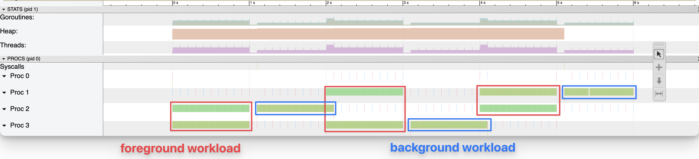

# go-cpu-utilization

This repository contains a naive attempt at measuring the CPU utilization of a
Go program and running a background workload when the utilization falls below a
certain threshold.

This is done by using [getrusage(2)](https://man7.org/linux/man-pages/man2/getrusage.2.html)
to measure the CPU time of the process.

## Results

The example program runs a foreground workload that has 2 goroutines running a
loop that burns CPU time for a second, followed by a one second sleep.

Additionally there is a background workload that kicks in whenever the CPU
utilization of the previous 100ms period falls below 1.5 CPU cores and stops
when it exceeds this threshold again.

Example output:

```
$ go run .
2022/12/17 22:28:24 starting background work: cores=0.09 < 1.50
2022/12/17 22:28:25 stopping background work: cores: 3.05 > 1.50
2022/12/17 22:28:26 starting background work: cores=0.03 < 1.50
2022/12/17 22:28:27 stopping background work: cores: 2.98 > 1.50
2022/12/17 22:28:28 starting background work: cores=0.08 < 1.50
```

Example trace:



## Discussion

The result seems promising, but it's also showing the challenges of building
such a control loop against a lagging indicator. The background workload does a
good job of not kicking in while the foreground workload is running, but takes
up to 100ms to stop when the foreground workload comes back.

But unless the Go runtime introduces the concept of priorities into the
scheduler, users may have to resort to this or [similar](https://www.cockroachlabs.com/blog/rubbing-control-theory/) workarounds.

Future study is needed to determine practical limits for the cpu utilization
measurement period. Theoretically the cost of a syscall (a few usec?) should be
the absolute lower bound. Practically speaking the jiffy interval (usually 4ms)
interval of the kernel may result in a higher floor.

Disclaimer: The above may be partially or entirely wrong. My knowledge of the
involved components and underlaying scheduling theory is very limited and I've
never used the presented mechanism in a production system.
